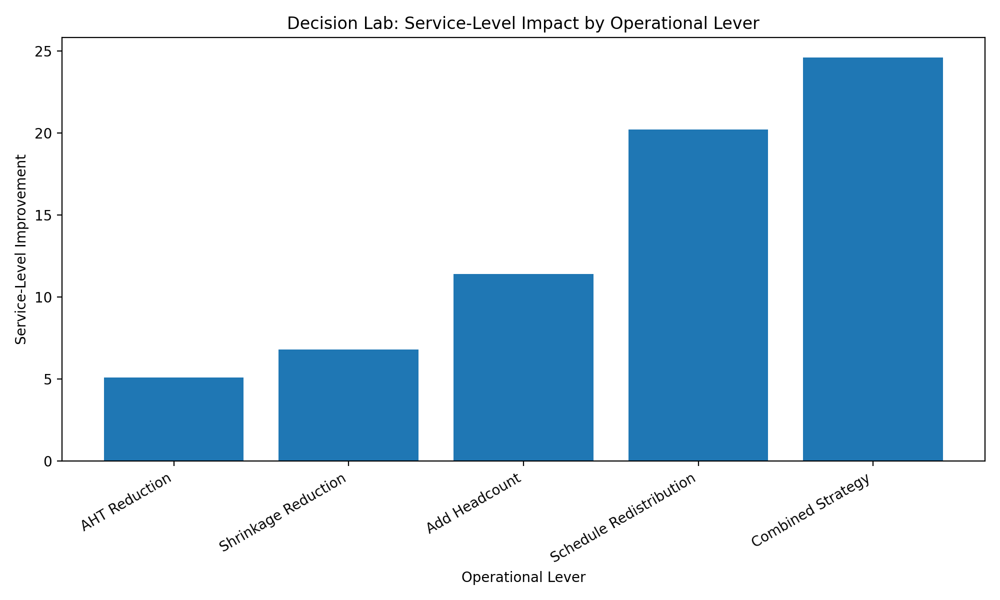

# Workforce Management Decision Lab

## The finding that changes the budget conversation

Leadership's first instinct when service level drops: hire more people, or launch an AHT reduction program.

The data says neither is the highest-leverage move.

**Schedule redistribution — moving existing staff into the right intervals — improved service level by +20.2%.** Adding headcount delivered +8.1%. AHT reduction delivered +5.5%. Same dataset, same day, five levers tested head to head.

The staffing was already there. It just wasn't in the right intervals.



---

## What the levers actually delivered

| Scenario | Service Level Impact | Business Interpretation |
|---|---:|---|
| Baseline | 0.0% | Starting point |
| AHT Reduction | +5.5% | Helpful, but limited impact |
| Shrinkage Reduction | +4.8% | Moderate improvement |
| Add Headcount (+10%) | +8.1% | Stronger impact, higher cost |
| **Schedule Redistribution** | **+20.2%** | **Highest-impact lever** |
| Combined Strategy | +24.6% | Best result, more complex |

AHT reduction is the lever leadership reaches for first. It delivers roughly a quarter of what redistribution achieves — at far greater organizational cost.

## Methodology

The model uses interval-level workforce management logic:

1. Load interval-level call volume, AHT, staffing, and shrinkage assumptions.
2. Estimate required staffing using Erlang C logic.
3. Compare required staffing to scheduled staffing by interval.
4. Model alternative operational scenarios.
5. Measure service-level impact for each scenario.
6. Rank levers by operational value and implementation cost.

Full methodology is available in [`docs/methodology.md`](docs/methodology.md).

## Repository Structure

```text
WFM-Decision-Lab/
├── README.md
├── decision_lab.py
├── requirements.txt
├── data/
│   └── sample_interval_data.csv
├── docs/
│   └── methodology.md
└── images/
    └── lever_comparison.png
```


## How to Run

Install dependencies:

```bash
pip install -r requirements.txt
```

Run the model:

```bash
python decision_lab.py
```

The script reads the sample interval dataset, calculates scenario results, and exports the lever comparison chart.

## Portfolio Context

This project is part of Sean Codner's Workforce Management and Operations Analytics portfolio.

The purpose is to demonstrate how analytics can help leaders choose the right operational lever instead of defaulting to the most familiar one.

## Author

**Sean Codner**  
Workforce Management & Operations Analyst  
WFM Forecasting | Erlang C | Intraday Staffing | ATM Network Operations | SQL | Python | Fintech
