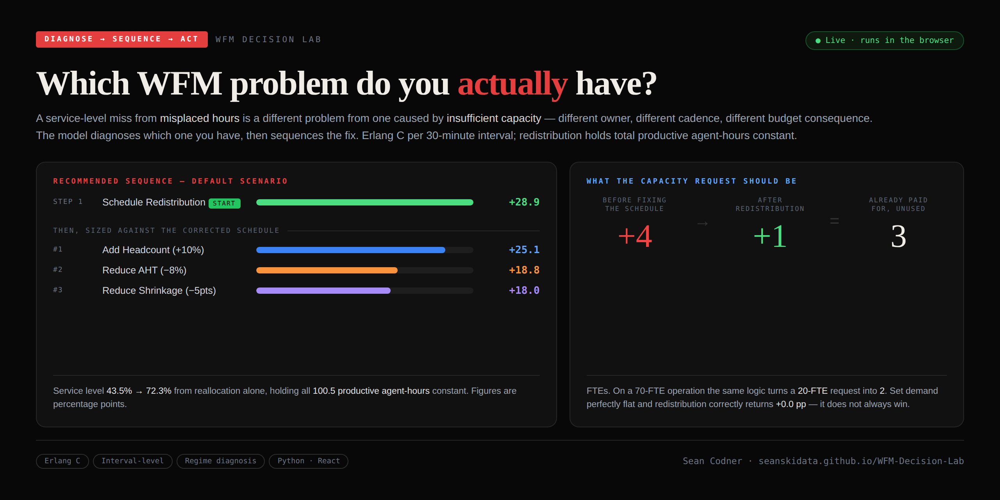

# Workforce Management Decision Lab

**[→ Run the interactive model in your browser](https://seanskidata.github.io/WFM-Decision-Lab)**

No install, no signup. Enter your own call volume, AHT, shrinkage and FTE count; the model runs
Erlang C per 30-minute interval across a simulated day, diagnoses which kind of problem you have,
and sequences the fix.

---

## The finding

When service level drops, the instinct is to hire or to launch an AHT reduction program.
Modeled at interval level, neither is reliably the first move.

**Reshaping the existing schedule to match interval demand — without adding a single productive
agent-hour — outperformed a 10% headcount increase in the default scenario.**

The staffing was already there. It just wasn't in the intervals where demand landed.

But the more useful output isn't the lever ranking. It's the diagnosis underneath it.

---

## Diagnosis before ranking

A service-level miss caused by **misplaced hours** is a different problem from one caused by
**insufficient capacity**. Different owner, different cadence, different budget consequence.
Ranking four levers without saying which problem you have assumes the reader already knows.

The model classifies into one of four regimes before it recommends anything:

| Regime | Test | Owner | Cadence |
|---|---|---|---|
| **Target met** | Baseline already clears the target | No action indicated | Monitor |
| **Distribution-constrained** | Reallocation alone reaches the target | Scheduling | Weekly / intraday |
| **Mixed** | Reallocation helps materially but can't close it | Scheduling, then Capacity Planning | Weekly, then budget |
| **Capacity-constrained** | Reallocation changes almost nothing | Capacity Planning | Budget / hiring |

The classification runs two explicit tests, both shown in the tool:

1. **Slot balance** — total productive half-hour slots against the summed interval requirement.
2. **Reach** — whether the best available reallocation of those same hours actually hits the target.

Test 2 is the binding one, because aggregate service level is call-weighted: an operation can
miss the per-interval requirement during quiet intervals and still clear target overall.

> **Materiality rule.** If reallocation cannot reach target but recovers at least **2.0 percentage
> points**, the constraint is classified as Mixed rather than Capacity. That threshold is a
> configurable decision rule, not an Erlang C result.

---

## What the capacity request should be

This is the output the diagnosis makes possible. Most capacity requests are sized against the
current schedule. If that schedule has hours in the wrong intervals, the request inherits the
error and asks for capacity that is already funded.

Modeled 70-FTE operation, demand peakiness 1.3:

| | FTEs |
|---|---:|
| Ask sized against the current schedule | **+20** |
| Ask sized after redistribution | **+2** |
| Difference — already funded, misallocated | **18** |

Reallocating the same **369.5 productive agent-hours** lifts modeled service level from
**33.7%** to **72.7%** before a single hire is approved.

---

## Default scenario

1,200 calls · 240s AHT · 34% shrinkage · 19 scheduled FTEs · typical double-hump demand

Baseline delivers **43.5%** against an 80/20 target. 21 FTEs are required, 19 are scheduled.
**10 of 16 intervals are understaffed, 4 are overstaffed.** Diagnosis: **Mixed**.

**Step 1 — reallocate first**

| Lever | SL Lift (pp) | Resulting SL | Implementation consideration |
|---|---:|---:|---|
| **Schedule Redistribution** | **+28.9** | **72.3%** | No additional headcount assumed |

**Step 2 — capacity options, sized against the corrected schedule**

| Lever | SL Lift (pp) | Resulting SL | Implementation consideration |
|---|---:|---:|---|
| Add Headcount (+10%) | +25.1 | 68.5% | Incremental payroll required |
| Reduce AHT (−8%) | +18.8 | 62.3% | Operational investment may be required |
| Reduce Shrinkage (−5pts) | +18.0 | 61.5% | Implementation effort varies |

Reported separately, because it is two levers rather than one:

| Compound scenario | SL Lift (pp) | Resulting SL |
|---|---:|---:|
| Redistribution + Shrinkage Reduction | +40.0 | 83.5% — clears the target |

Redistribution holds **100.5 productive agent-hours** (201 half-hour slots) exactly constant.
It adds no capacity; it moves existing capacity between intervals.

---

## Where the finding breaks

A model that always favors its own headline lever is less useful, not more. Two disclosures:

**Flat demand returns exactly +0.0 pp.** Set peakiness to zero and redistribution recovers
nothing, because a flat day has nothing to redistribute. The regime correctly flips to
capacity-constrained.

**Redistribution beats a 10% headcount add in 38% of scenarios**, not all of them. Across a sweep
of scenarios that miss target, it wins 44 of 116. The finding is not "redistribution beats
hiring." It is: diagnose the interval problem before assuming the answer is more headcount.

The lever magnitudes are adjustable sliders specifically so the ranking can be broken.

---

## Two models in this repository

| | Python notebook (`decision_lab.py`) | Interactive tool (`index.html`) |
|---|---|---|
| Demand | Fixed sample interval dataset | Simulated curve from a peakiness setting |
| Schedule | Fixed baseline in the dataset | Evenly distributed baseline |
| Inputs | Set in code | Adjustable by the user |
| Output | A documented case study | Regime diagnosis and sequenced levers |

Both use Erlang C at the interval level and demonstrate the same diagnostic principle, but the
magnitudes differ because the demand pattern and baseline schedule differ. Neither analyzes an
organization's real forecast.

---

## Methodology

1. Distribute call volume across 30-minute intervals.
2. Convert volume and AHT into offered load (Erlangs).
3. Size required agents per interval using Erlang C, under an occupancy ceiling.
4. Apply a shrinkage build-up to convert on-phone agents into scheduled FTEs.
5. Compare scheduled coverage against the interval requirement.
6. Classify the regime, then model each lever and measure call-weighted service level.

Redistribution reshapes the schedule toward the interval requirement curve while holding total
productive agent-hours fixed, and is floored so no interval is stripped to feed the peaks. The
baseline schedule is always a candidate allocation, so redistribution can never score worse than
leaving the schedule alone.

Full detail in [`methodology.md`](methodology.md).

### Model assumptions

Poisson call arrivals · exponential handle times · **no abandonment** (Erlang C, not Erlang A) ·
a single homogeneous agent skill · no transfers or retries · steady state within each interval ·
redistributed staffing assumed operationally movable · no shift-length, labor-rule, skill or
break-placement constraints.

These assumptions are appropriate for a planning-stage capacity model, but they are not a
substitute for a scheduling engine that respects real shift rules.

### What a production build would add

Abandonment-aware queueing (Erlang A), so caller patience is modeled rather than assumed
infinite. Multi-skill and blended workload, since most operations are not a single queue.
Shift-constrained optimization, so a recommended redistribution is actually rosterable under
labor rules. Intraday re-forecasting. And import of real interval forecasts and schedules in
place of the generated demand curve.

---

## Repository structure

```
WFM-Decision-Lab/
├── README.md
├── index.html                    interactive model (GitHub Pages)
├── decision_lab.py               Python case-study model
├── methodology.md                full methodology
├── requirements.txt
├── sample_interval_data.csv
├── lever_comparison.png
└── wfm-decision-lab-hero.png
```

## Running the Python model

```bash
pip install -r requirements.txt
python decision_lab.py
```

---

## Author

**Sean Codner** — Workforce Management & Operations Analyst

WFM Forecasting · Erlang C · Intraday Staffing · ATM Network Operations · SQL · Python

Part of a workforce-management and operations analytics portfolio:
[github.com/SEANSKIDATA](https://github.com/SEANSKIDATA)
