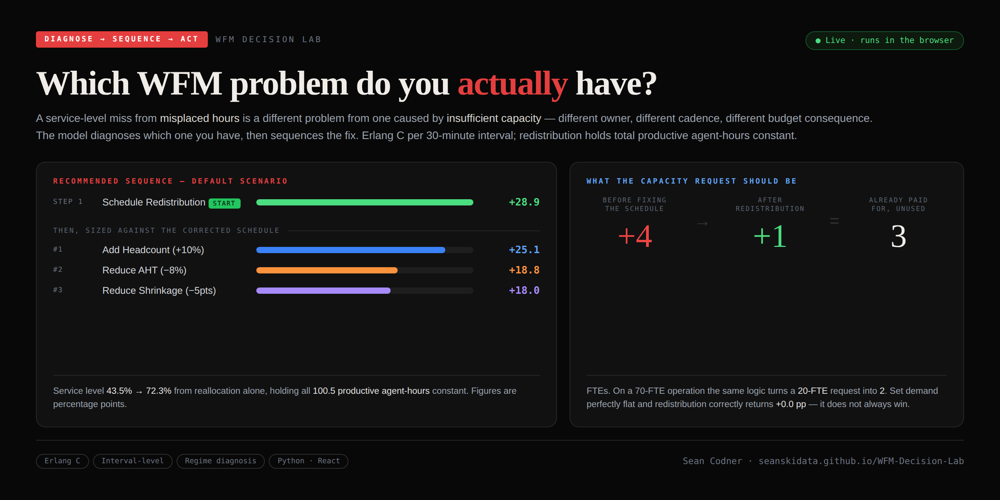

# Workforce Management Decision Lab

**[→ Run the interactive model in your browser](https://seanskidata.github.io/WFM-Decision-Lab)**

No install, no signup. Enter your own call volume, AHT, shrinkage and FTE count; the model runs
Erlang C per 30-minute interval across a simulated day, diagnoses which kind of problem you have,
and sequences the fix.

---

## The finding

When service level drops, the instinct is to hire or to launch an AHT reduction program.
Modeled at interval level, neither is reliably the first move.

**Reshaping the existing schedule to match interval demand — without adding a single productive
agent-hour — outperformed a 10% headcount increase in the default scenario.**

The staffing was already there. It just wasn't in the intervals where demand landed.

But the more useful output isn't the lever ranking. It's the diagnosis underneath it.

---

## Diagnosis before ranking

A service-level miss caused by **misplaced hours** is a different problem from one caused by
**insufficient capacity**. Different owner, different cadence, different budget consequence.
Ranking four levers without saying which problem you have assumes the reader already knows.

The model classifies into one of four regimes before it recommends anything:

| Regime | Test | Owner | Cadence |
|---|---|---|---|
| **Target met** | Baseline already clears the target | No action indicated | Monitor |
| **Distribution-constrained** | Reallocation alone reaches the target | Scheduling | Weekly / intraday |
| **Mixed** | Reallocation can't reach target, but reduces the capacity request by ≥1 FTE | Scheduling, then Capacity Planning | Weekly, then budget |
| **Capacity-constrained** | Reallocation doesn't reduce the capacity request | Capacity Planning | Budget / hiring |

The classification runs three explicit tests, all shown in the tool:

1. **Slot balance** — total productive half-hour slots against the summed interval requirement.
2. **Reach** — whether the best available reallocation of those same hours actually hits the target.
3. **Capacity ask** — if it doesn't, whether reallocating first reduces the capacity request.

Test 2 overrides Test 1, because aggregate service level is call-weighted: an operation can
miss the per-interval requirement during quiet intervals and still clear target overall.

> **Action threshold.** If reallocation cannot reach target but reduces the capacity request by
> at least **1 FTE**, the constraint is classified as Mixed rather than Capacity. Requests are
> searched in whole FTE. That threshold is a decision rule, not an Erlang C result.
>
> It replaces an earlier rule that classified Mixed when reallocation recovered at least 2.0
> percentage points of service level. That rule measured reallocation at *current* staffing,
> where a collapsed queue shows almost no gain, even when reallocating a larger pool would cut
> the hiring request. Across the 695 scenarios where the distinction applies, the two rules
> disagreed in 514; in 507 of them the old rule called Capacity where reallocation reduced the
> request. See [`CHANGELOG.md`](CHANGELOG.md) and [`analysis/`](analysis/).

---

## What the capacity request should be

This is the output the diagnosis makes possible. Most capacity requests are sized against the
current schedule. If that schedule has hours in the wrong intervals, the request inherits the
error and asks for capacity that is already funded.

Modeled 70-FTE operation · 4,000 calls · 300s AHT · 34% shrinkage · demand peakiness 1.3:

| | FTEs |
|---|---:|
| Ask sized against the current schedule | **+20** |
| Ask sized after redistribution | **+2** |
| Difference — already funded, misallocated | **18** |

Reallocating the same **369.5 productive agent-hours** lifts modeled service level from
**33.7%** to **72.7%** before a single hire is approved.

---

## Default scenario

1,200 calls · 240s AHT · 34% shrinkage · 19 scheduled FTEs · typical double-hump demand

Baseline delivers **43.5%** against an 80/20 target. 21 FTEs are required, 19 are scheduled.
**10 of 16 intervals are understaffed, 4 are overstaffed.** Diagnosis: **Mixed**.

**Step 1 — reallocate first**

| Lever | SL Lift (pp) | Resulting SL | Implementation consideration |
|---|---:|---:|---|
| **Schedule Redistribution** | **+28.9** | **72.3%** | No additional headcount assumed |

**Step 2 — capacity options, sized against the corrected schedule**

| Lever | SL Lift (pp) | Resulting SL | Implementation consideration |
|---|---:|---:|---|
| Add Headcount (+10%) | +25.1 | 68.5% | Incremental payroll required |
| Reduce AHT (−8%) | +18.8 | 62.3% | Operational investment may be required |
| Reduce Shrinkage (−5pts) | +18.0 | 61.5% | Implementation effort varies |

Reported separately, because it is two levers rather than one:

| Compound scenario | SL Lift (pp) | Resulting SL |
|---|---:|---:|
| Redistribution + Shrinkage Reduction | +40.0 | 83.5% — clears the target |

Redistribution holds **100.5 productive agent-hours** (201 half-hour slots) exactly constant.
It adds no capacity; it moves existing capacity between intervals.

---

## What's established

**Deployed** (live tool, covered by `tests/`): interval-level Erlang C across 16 half-hour
intervals · four-regime diagnosis using the 1-FTE capacity-ask test · capacity request sized
against the corrected schedule · redistribution that holds productive agent-hours constant.

**Established** (reproducible from this repository): the default and 70-FTE scenarios above ·
flat demand returns exactly +0.0 pp · across 695 in-scope scenarios, the former 2.0 pp rule and
the FTE rule disagree in 514, 507 of them in one direction · at 0.1 FTE resolution the split is
519 / 0 · 37 scenarios (5.3%) save more than 0 but less than 1 FTE, all at 8, 12 or 19 FTE.

**Experimental** (analysis only, not in the live tool): fractional-FTE measurement and
separate action thresholds. A fixed threshold penalizes small operations (22-point spread
across operation sizes at 2 FTE). A proportional threshold mostly removes that at 5% (4-point
spread) but reverses it at 10%. Neither a universal FTE threshold nor a universal percentage
fully represents operational actionability.

A second, load-matched sweep (`analysis/sweep_scale.js`: call volume scaled so every size
carries the same utilization, 8 to 500 FTE, 1,215 scenarios, 781 in scope) found that savings
do not compress into a percentage band at larger sizes. The median saving rises from 20% of
the operation at 8 FTE to 32% at 500 FTE, and the middle half stays 23 to 26 points wide.
Small operations do sit on a different curve: Erlang C safety staffing makes their interval
requirement about 7% flatter than their demand curve at 8 FTE, converging by 70 to 100 FTE
(`analysis/sweep_scale_mechanism.js`). Share classified Mixed, 8 → 500 FTE: fixed 1 FTE
64% → 100%; proportional 5% 83% → 100% (stops discriminating from 100 FTE); proportional 10%
69–80% at every size. The 10% threshold tilted the other way on the fixed-volume grid, so a
threshold's size bias depends on which operations it is tested against.

**Open questions:** what threshold operators actually act on, and whether it depends on
operation size, the cost of a schedule change, planning horizon, or who owns the decision.

---

## Where the finding breaks

A model that always favors its own headline lever is less useful, not more. Two disclosures:

**Flat demand returns exactly +0.0 pp.** Set peakiness to zero and redistribution recovers
nothing, because a flat day has nothing to redistribute. The regime correctly flips to
capacity-constrained.

**Redistribution beats a 10% headcount add in a minority of scenarios.** Across the 1,470-scenario
grid, 770 miss target. In 379 of those the queue is so far over capacity that neither lever moves
service level by 0.1 pp. Of the remaining 391, redistribution beats the headcount add in 103
(26%), and never on flat or near-flat demand (peakiness 0 and 0.4). The finding is not
"redistribution beats hiring." It is: diagnose the interval problem before assuming the answer
is more headcount, and size any hiring request against a corrected schedule.

The lever magnitudes are adjustable sliders specifically so the ranking can be broken.

---

## Methodology

1. Distribute call volume across 30-minute intervals.
2. Convert volume and AHT into offered load (Erlangs).
3. Size required agents per interval using Erlang C, under an occupancy ceiling.
4. Apply a shrinkage build-up to convert on-phone agents into scheduled FTEs.
5. Compare scheduled coverage against the interval requirement.
6. Classify the regime, then model each lever and measure call-weighted service level.

Redistribution reshapes the schedule toward the interval requirement curve while holding total
productive agent-hours fixed, and is floored so no interval is stripped to feed the peaks. The
baseline schedule is always a candidate allocation, so redistribution can never score worse than
leaving the schedule alone.

Full detail in [`methodology.md`](methodology.md).

### Model assumptions

Poisson call arrivals · exponential handle times · **no abandonment** (Erlang C, not Erlang A) ·
a single homogeneous agent skill · no transfers or retries · steady state within each interval ·
redistributed staffing assumed operationally movable · no shift-length, labor-rule, skill or
break-placement constraints.

These assumptions are appropriate for a planning-stage capacity model, but they are not a
substitute for a scheduling engine that respects real shift rules.

### What a production build would add

Abandonment-aware queueing (Erlang A), so caller patience is modeled rather than assumed
infinite. Multi-skill and blended workload, since most operations are not a single queue.
Shift-constrained optimization, so a recommended redistribution is actually rosterable under
labor rules. Intraday re-forecasting. And import of real interval forecasts and schedules in
place of the generated demand curve.

---

## Repository structure

```
WFM-Decision-Lab/
├── README.md
├── CHANGELOG.md
├── index.html                    interactive model and engine (GitHub Pages)
├── methodology.md                full methodology
├── tests/
│   ├── regression.test.js        regression suite, runs against index.html
│   ├── load_engine.js            extracts the engine from index.html
│   └── grid.js                   the 1,470-scenario grid
├── analysis/
│   ├── sweep_resolution.js       old 2.0 pp rule vs FTE rule, by measurement resolution
│   ├── sweep_thresholds.js       fixed vs proportional action thresholds (experimental)
│   ├── sweep_levers.js           redistribution vs a 10% headcount add
│   ├── sweep_scale.js            load-matched sweep, 8 to 500 FTE (experimental)
│   ├── sweep_scale_mechanism.js  how much Erlang C flattens the requirement curve, by size
│   ├── saving.js                 capacity-request saving at a chosen FTE resolution
│   └── results/                  CSV outputs of the sweeps
└── wfm-decision-lab-hero.png
```

## Reproducing every number

Requires Node 18+. No dependencies, no install.

```bash
node tests/regression.test.js      # ~10,000 checks: fixtures, regime counts, invariants, monotonicity
node analysis/sweep_levers.js
node analysis/sweep_thresholds.js  # ~1–2 min
node analysis/sweep_resolution.js  # ~3–5 min
node analysis/sweep_scale.js       # a few seconds
node analysis/sweep_scale_mechanism.js
```

The tests load the engine straight from `index.html`, so they always check the deployed code.
They assert the default and 70-FTE scenarios above, the regime counts across the grid (700
target met · 75 distribution · 559 mixed · 136 capacity), that redistribution conserves
agent-hours and never scores below the baseline schedule, that every regime satisfies its own
test, and that adding staff never lowers service level while adding volume or handle time never
raises it.

---

## Author

**Sean Codner** — Workforce Management & Operations Analyst

WFM Forecasting · Erlang C · Intraday Staffing · ATM Network Operations · SQL · Python

Part of a workforce-management and operations analytics portfolio:
[github.com/SEANSKIDATA](https://github.com/SEANSKIDATA)
